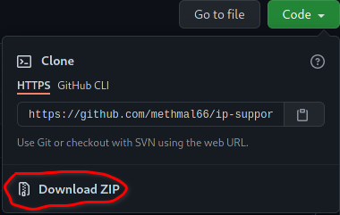

# ip-support
This repository includes the necessary reference code for ip support sessions @SLIIT Malabe.
These IP support sessions are conducted by the students from 2021-may intake with ❤️

If you are student from a different university or even by yourselves, 
it is fine to use this repo as a guide to write better code
and refactor already existing code.

## Important things to keep in mind
- There may be lot more methods to imporve the code. 
 But only unique approches have been mentioned for the sake of everyone.
- Comments are added as highliting the new techniques relative to the previous file.
- Programs are rated by their file names based on readability and efficiency.
- It is recommended to go through the files in the ascending order.

## Contribute
Their may be small mistakes like errors in displayed messages. If you have ever found one, or know how to improve the code even further, feel free to open a new Pull Request

## Download the repo
Start by geting a local copy of the repo
>git clone https://github.com/methmal66/ip-support.git

and

Update the repo, after an each session
>git pull

or

If git in not installed in your computer yet,  download the zip file of the entire repo by clicking on the green button at the top right corner.

